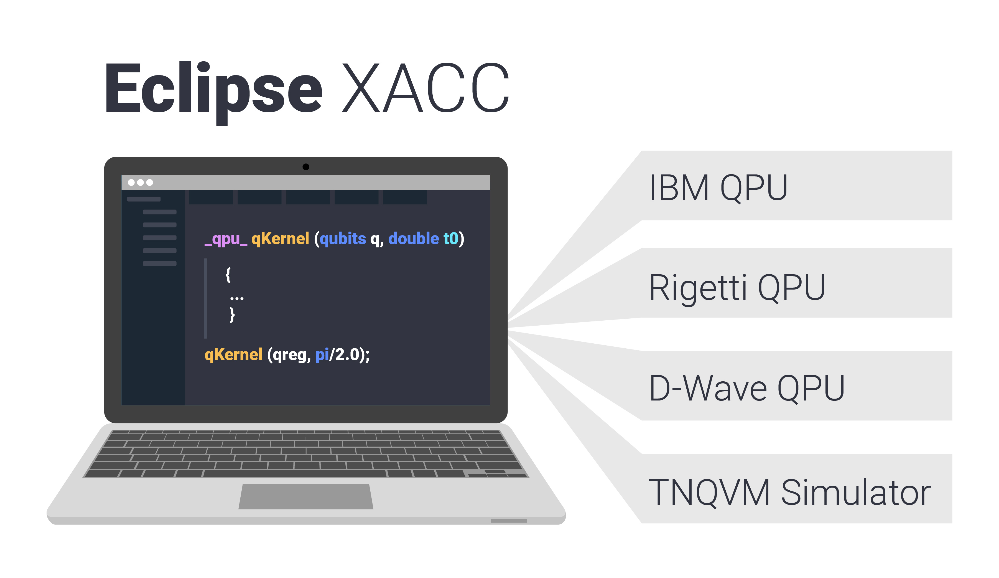

.. XACC documentation master file, created by
   sphinx-quickstart on Tue Aug 29 20:23:35 2017.
   You can adapt this file completely to your liking, but it should at least
   contain the root `toctree` directive.

Welcome to XACC's documentation!
================================

Overview
---------

XACC is an extensible compilation framework for hybrid quantum-classical
computing architectures. It provides extensible language frontend and hardware
backend compilation components glued together via a novel, polymorphic quantum intermediate
representation. XACC currently supports quantum-classical programming and enables
the execution of quantum kernels on IBM, Rigetti, and D-Wave QPUs, as well as a
number of quantum computer simulators.

The XACC programming model follows the traditional co-processor model, akin to OpenCL or CUDA for GPUs, but
takes into account the subtleties and complexities inherent to the interplay
between classical and quantum hardware. XACC provides a high-level API that
enables classical applications to offload work
(represented as quantum kernels) to an attached quantum accelerator in a
manner that is independent to the quantum programming language and hardware.
This enables one to write quantum code once, and perform benchmarking,
verification and validation, and performance studies for a set of virtual
(simulators) or physical hardware.

Modular Infrastructure
---------------------------
XACC relies on a project called `CppMicroServices <http://github.com/cppmicroservices/cppmicroservices>`_ -
a native C++ implementation of the `OSGi <https://www.osgi.org/developer/architecture/>`_
specification that enables an extensible, modular
plugin infrastructure for quantum compilers and accelerators. Installation of
XACC provides the core infrastructure for describing Programs, Compilers,
Accelerators, and IR. To enable support for various compilers and accelerators
(like the OpenQasm or Quil compilers, or the IBM or Rigetti QPUs) you
can install the appropriate plugin (see `XACC Plugins <plugins.html>`_).

XACC Development Team
----------------------

XACC is developed and maintained by:

* `Alex McCaskey <mccaskeyaj@ornl.gov>`_
* `Travis Humble <humblets@ornl.gov>`_
* `Eugene Dumitrescu <dumitrescuef@ornl.gov>`_
* `Dmitry Liakh <liakhdi@ornl.gov>`_
* `Mengsu Chen <mschen@vt.edu>`_
* `Zach Parks <parkszp@ornl.gov>`_
* `Ryan Sand <rsand3642@gmail.com>`_
* `Charles Zhao <czhao39@gmail.com>`_
* `Jay Billings <billingsjj@ornl.gov>`_

Questions, Bug Reporting, and Issue Tracking
---------------------------------------------

Questions, bug reporting and issue tracking are provided by GitHub. Please
report all bugs by creating a `new issue <https://github.com/eclipse/xacc/issues/new>`_.
You can ask questions by creating a new issue with the question tag.

.. toctree::
   :maxdepth: 4
   :caption: Contents:

   install
   arch
   plugins
   tutorials
   apps

Publications
------------

[1] `A language and hardware independent approach to quantum-classical computing <https://www.sciencedirect.com/science/article/pii/S2352711018300700>`_

[2] `Validating Quantum-Classical Programming Models with Tensor Network Simulations <https://arxiv.org/abs/1807.07914>`_

[3] `Hybrid Programming for Near-term Quantum Computing Systems <https://arxiv.org/abs/1805.09279>`_

Publications Leveraging XACC
----------------------------
[1] `Cloud Quantum Computing of an Atomic Nucleus <https://journals.aps.org/prl/abstract/10.1103/PhysRevLett.120.210501>`_

[2] `Quantum-Classical Computations of Schwinger Model Dynamics using Quantum Computers <https://journals.aps.org/pra/abstract/10.1103/PhysRevA.98.032331>`_

.. toctree::
   :caption: API Reference
   :maxdepth: 2

   api/api-index.rst

Indices and tables
==================

* :ref:`genindex`
* :ref:`modindex`
* :ref:`search`
