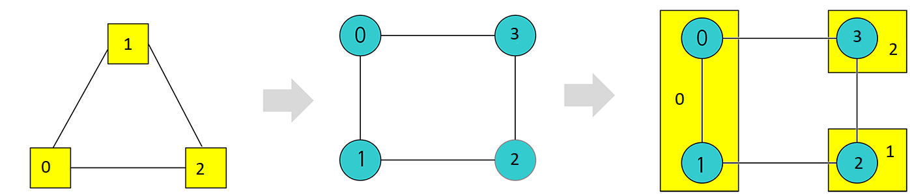
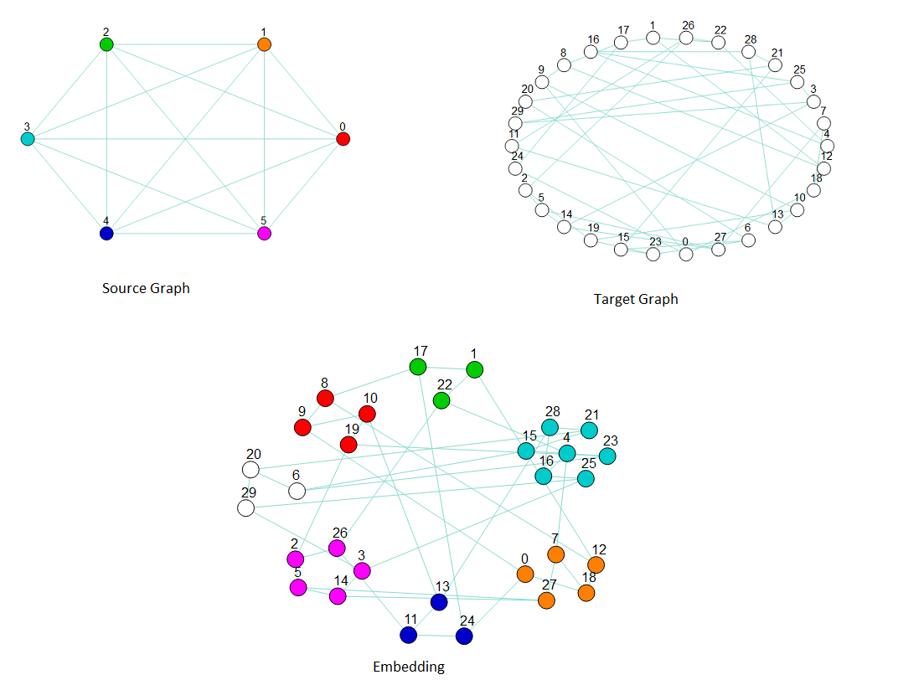

.. intro:

============
Introduction
============

.. automodule:: minorminer

Examples
========

This example minor embeds a triangular source K4 graph onto a square target graph.

.. code-block:: python

    from minorminer import find_embedding

    # A triangle is a minor of a square.
    triangle = [(0, 1), (1, 2), (2, 0)]
    square = [(0, 1), (1, 2), (2, 3), (3, 0)]

    # Find an assignment of sets of square variables to the triangle variables
    embedding = find_embedding(triangle, square, random_seed=10)
    print(len(embedding))  # 3, one set for each variable in the triangle
    print(embedding)
    # We don't know which variables will be assigned where, here are a
    # couple possible outputs:
    # [[0, 1], [2], [3]]
    # [[3], [1, 0], [2]]

  Embedding a :math:`K_3` source graph into a square target graph by chaining two
  target nodes to represent one source node.

This minorminer execution of the example requires that source variable 0 always be assigned
to target node 2.

.. code-block:: python

    embedding = find_embedding(triangle, square, fixed_chains={0: [2]})
    print(embedding)
    # [[2], [3, 0], [1]]
    # [[2], [1], [0, 3]]
    # And more, but all of them start with [2]

This minorminer execution of the example suggests that source variable 0 be assigned to
target node 2 as a starting point for finding an embedding.

.. code-block:: python

    embedding = find_embedding(triangle, square, initial_chains={0: [2]})
    print(embedding)
    # [[2], [0, 3], [1]]
    # [[0], [3], [1, 2]]
    # Output where source variable 0 has switched to a different target node is possible.

This example minor embeds a fully connected K6 graph into a 30-node random regular graph of degree 3.

.. code-block:: python

    import networkx as nx

    clique = nx.complete_graph(6).edges()
    target_graph = nx.random_regular_graph(d=3, n=30).edges()

    embedding = find_embedding(clique, target_graph)

    print(embedding)
    # There are many possible outputs, and sometimes it might fail
    # and return an empty list
    # One run returned the following embedding:
    {0: [10, 9, 19, 8],
     1: [18, 7, 0, 12, 27],
     2: [1, 17, 22],
     3: [16, 28, 4, 21, 15, 23, 25],
     4: [11, 24, 13],
     5: [2, 14, 26, 5, 3]}

  Embedding a :math:`K_6` source graph (upper left) into a 30-node random target graph of
  degree 3 (upper right) by chaining several target nodes to represent one source node (bottom).
  The graphic of the embedding clusters chains representing nodes in the source graph: the
  cluster of red nodes is a chain of target nodes that represent source node 0, the orange
  nodes represent source node 1, and so on.
